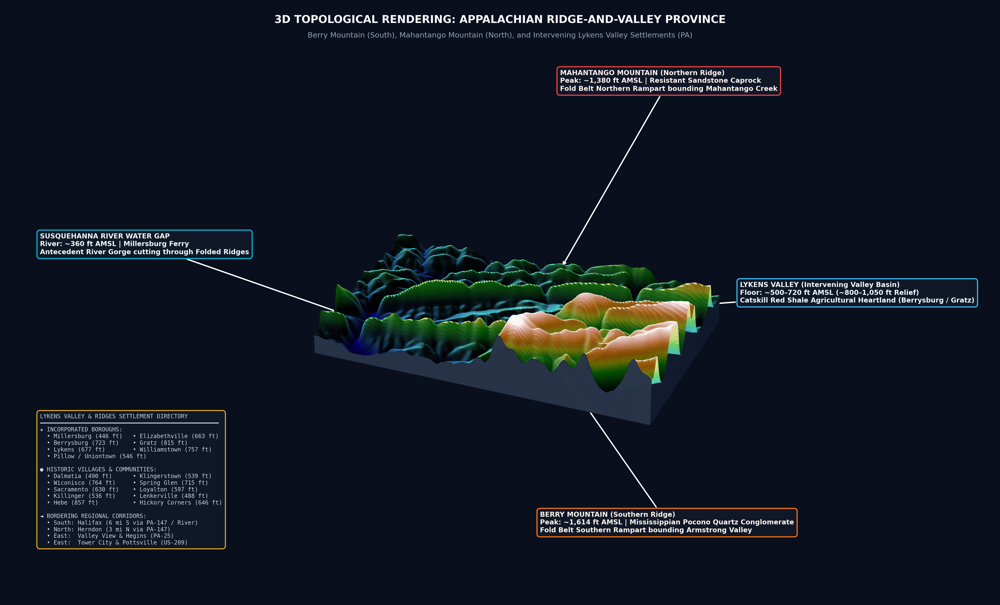

# Appalachian 3D Topographical Explorer: Berry Mountain & Mahantango Mountain

An interactive 3D WebGL topological rendering, cartographic cross-section profile, and shaded relief map suite visualizing the **Berry Mountain – Mahantango Mountain** section of the Appalachian Ridge-and-Valley Province in Pennsylvania, featuring the intervening **Lykens Valley (Mahantango Valley)** and the **Susquehanna River Water Gap**.



## Overview & Geomorphology

Formed during the late Paleozoic **Alleghanian Orogeny** (~320–280 Ma), this landscape exhibits classic Appalachian fold-and-thrust relief. Severe tectonic compression bent Paleozoic sedimentary strata into enormous anticlines and synclines. Millions of years of differential erosion sculpted the topography:

- **Berry Mountain (Southern Ridge Rampart)**: Crest elevations of **1,220 – 1,614 ft AMSL**, capped by weather-resistant Mississippian Pocono Sandstone & Conglomerate.
- **Mahantango Mountain (Northern Ridge Rampart)**: Crest elevations of **1,012 – 1,380 ft AMSL**, upheld by resistant Silurian/Devonian quartzitic sandstones.
- **Lykens Valley (Intervening Agricultural Basin)**: Floor elevations of **500 – 620 ft AMSL**, eroded deeply into soft Upper Devonian Catskill Formation red shales and siltstones (~700 to 1,060 ft of vertical relief).
- **Susquehanna River Water Gap**: Antecedent river gorge slicing transversely through the folded sandstone ridges at Millersburg (~360 ft AMSL).

## Visualizations & Scientific Deliverables

1. **`index.html` / `appalachian_3d_viewer.html`**: Fully standalone, interactive Three.js WebGL 3D terrain viewer with:
   - True geomorphic scaling & adjustable vertical exaggeration slider (1.0x to 5.0x)
   - Solid architectural pedestal skirt walls
   - Animated camera presets (*Valley Flight*, *Berry Ridge*, *Mahantango Ridge*, *Water Gap*, *Top-Down Map*)
   - Real-time cursor elevation raycasting (feet and meters, lat/lon)
   - 17 interactive settlement pins & POI billboard banners
2. **`berry_mahantango_3d_render.png`**: High-resolution 3D shaded relief plate with labeled summits and features.
3. **`appalachian_cross_section_profile.png`**: South-to-North geomorphic cross-section transect along the 76.8114°W meridian.
4. **`appalachian_topographical_map.png`**: 2D shaded relief and 150-ft index contour map with complete settlement symbology.
5. **`appalachian_multi_view_3d.png`**: Multi-perspective 3D analysis sheet and geological synthesis.
6. **`appalachian_berry_mahantango_3d_photoreal.jpg`**: Photorealistic museum-grade relief diorama block.

## Regional Settlements Included

- **Incorporated Boroughs**: Millersburg, Elizabethville, Berrysburg, Gratz, Lykens, Williamstown, Pillow (Uniontown).
- **Villages & Settlements**: Lenkerville, Killinger, Loyalton, Wiconisco, Spring Glen, Sacramento, Klingerstown, Dalmatia, Hebe, Hickory Corners.
- **Border Corridors**: Halifax & Harrisburg (South), Herndon & Sunbury (North), Valley View & Hegins (East), Tower City & Pottsville (East).

## Running Locally

Simply open `index.html` in any web browser, or run a local HTTP server:

```bash
# Python 3
python -m http.server 8080
```

Then visit `http://localhost:8080` in your browser.

## Deployment

### Docker / Google Cloud Run (Lowest Cost / Free Tier)
This repository includes a minimal Alpine Nginx `Dockerfile` configured for Cloud Run (port 8080):

```bash
docker build -t appalachian-3d .
docker run -p 8080:8080 appalachian-3d
```
